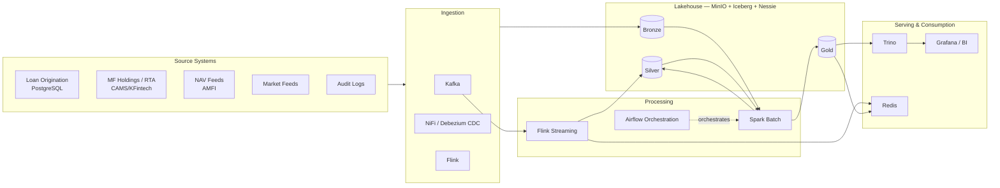

# LAMF Data Platform — Enterprise Lakehouse for Loan Against Mutual Funds

> A production-grade, end-to-end Data Engineering platform for a **Loan Against Mutual Fund (LAMF)** fintech, built on a modern **Lakehouse + Medallion** architecture with batch and streaming pipelines.
---

## Why this project stands out

- **Real domain, real complexity.** LAMF is a regulated, collateral-backed lending product where the value of collateral (mutual fund units) changes *every day* with NAV. That makes it a perfect blend of **batch** (daily portfolio valuation, regulatory reporting) and **streaming** (real-time NAV → drawing-power → margin-call recomputation).
- **Modern open lakehouse stack.** Iceberg table format, Nessie catalog, Trino query engine, MinIO object store — the exact stack top fintechs are standardizing on.
- **Engineering rigor.** Data quality (Great Expectations), governance (lineage, RBAC, audit), observability (Prometheus + Grafana)

## High-level architecture (at a glance)

---

## Tech stack

`Kafka` · `Apache NiFi` · `Apache Spark` · `Apache Airflow` · `Apache Flink` · `Apache Iceberg` · `Nessie` · `Hive Metastore` · `MinIO (S3)` · `Trino` · `PostgreSQL` · `Redis` · `Docker` · `Great Expectations` · `Grafana` · `Prometheus`

---
### Service endpoints

| Service | URL | Creds |
|---|---|---|
| MinIO console | http://localhost:9001 | admin / password123 |
| Nessie API | http://localhost:19120/api/v2 | — |
| Trino | http://localhost:8080 | — |
| Spark app UI | http://localhost:4040 | — |
| Flink UI | http://localhost:8083 | — |
| Airflow | http://localhost:8082 | admin / admin |
| Grafana | http://localhost:3000 | admin / admin |

### Repo layout

Key paths: `data/generators/` (synthetic data), `transform/spark/{bronze,silver,gold}` (medallion jobs), `streaming/flink/` (margin-call engine), `orchestration/airflow/dags/` (EOD DAG), `quality/` (DQ gates), `infra/` (Docker images + service config).
